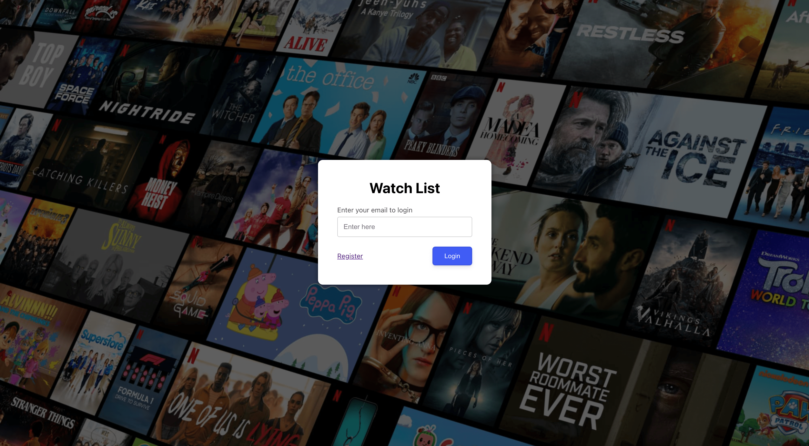
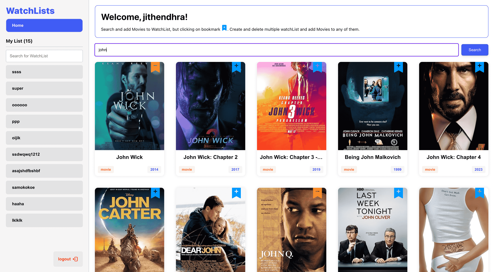
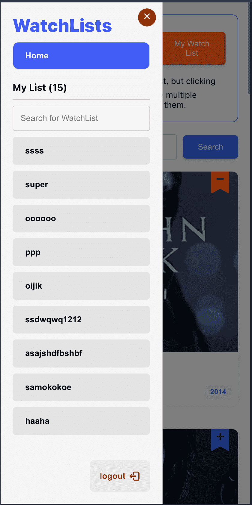
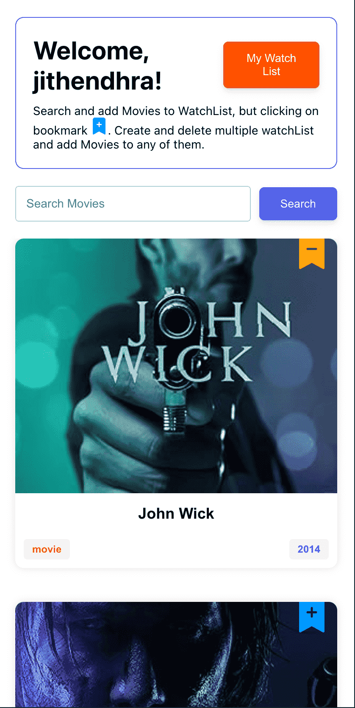
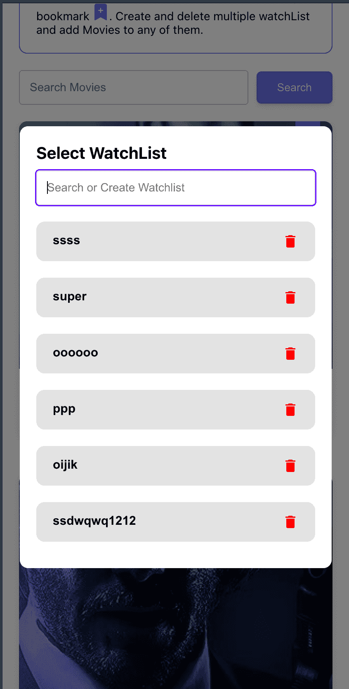

# JUST READ ME

Check out Website [WatchList](https://assignment-a2356.web.app/)
https://assignment-a2356.web.app/

## Screenshots

### desktop

### mobile

<table>
  <tr>
   <td>
   
   </td>
   <td>
   
   </td>
   <td>
   
   </td>
  </tr>
 </table>

## Project Structure

`/src`
`├── components`
`├── elements (building blocks)`
`├── hooks (custom hooks)`
`├── pages`
`├── tests`
`└── utils`

## Features

- mutiple users can use this platform
- can create, delete and rename watchlist
- can search movies and add to their watchlist on the go
- all are stored in local as of now
- responsive to all screens
- search watch lists

## State management

- I used context api only
- This project doesn't have a complex state to manage. which can be managed easily with context api itself.
- This project is designed and followed open/close principle, so without changing any code you can create store file for redux and integrate easily

## Testing

- unit testing (components testing)
- api testing (search and details api)

## Concepts used

- Component with hooks (custom Hooks)
- Datamanagement with provider (context)
- Custom Elements (p, input, button... etc)
- SOLID Principles

## Available Scripts

In the project directory, you can run:

### `npm start`

Runs the app in the development mode.\
Open [http://localhost:3000](http://localhost:3000) to view it in the browser.

The page will reload if you make edits.\
You will also see any lint errors in the console.

### `npm test`

Launches the test runner in the interactive watch mode.\
See the section about [running tests](https://facebook.github.io/create-react-app/docs/running-tests) for more information.
